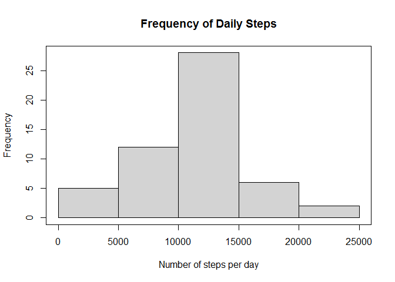
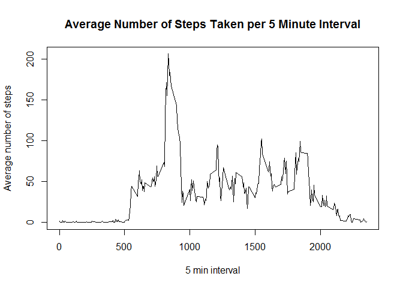
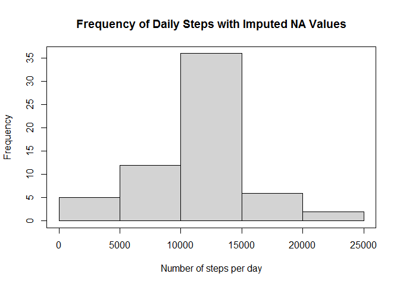
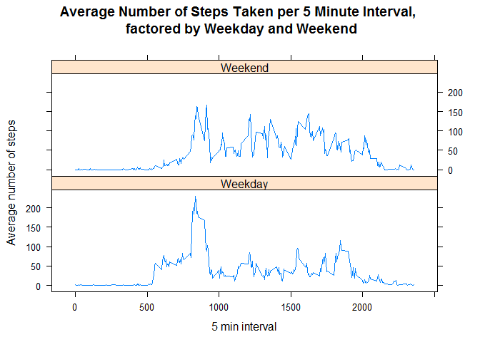

================================================================================

## Loading and preprocessing the data
The following chunk of code downloads the data and reads the activity.csv file 
into data frame `stepsData` and shows the first 10 lines:

```r
webURL <- "https://d396qusza40orc.cloudfront.net/repdata%2Fdata%2Factivity.zip"
temp <- tempfile()
download.file(webURL,temp)
unzip(zipfile = temp, exdir = "./StepsData")
stepsData <- read.csv("./StepsData/activity.csv")
unlink(temp)

head(stepsData,10)
```

```
##    steps       date interval
## 1     NA 2012-10-01        0
## 2     NA 2012-10-01        5
## 3     NA 2012-10-01       10
## 4     NA 2012-10-01       15
## 5     NA 2012-10-01       20
## 6     NA 2012-10-01       25
## 7     NA 2012-10-01       30
## 8     NA 2012-10-01       35
## 9     NA 2012-10-01       40
## 10    NA 2012-10-01       45
```

## What is mean total number of steps taken per day?
Plot the histogram of the total number of steps taken per day:

```r
dailySteps <- tapply(stepsData$steps,stepsData$date,sum)
hist(dailySteps, main="Frequency of Daily Steps",xlab="Number of steps per day", 
     ylab= "Frequency")
box()
```

<!-- -->

```r
meanSteps <- mean(dailySteps,na.rm=TRUE)
meanSteps <- format(meanSteps,scientic =FALSE,digits=6)
medSteps <- median(dailySteps,na.rm=TRUE)
medSteps <- format(medSteps,scientic =FALSE,digits=6)
```
The mean total number of steps taken each day is 10766.2 steps and the median total 
number of steps taken each day is 10765 steps.

## What is the average daily activity pattern?
Plot the time series of each 5 min time interval and the average number of steps per interval:

```r
intSteps <- tapply(stepsData$steps,stepsData$interval,mean,na.rm=TRUE)
plot(unique(stepsData$interval),intSteps,main="Average Number of Steps Taken per 5 Minute Interval",
     xlab="5 min interval", ylab= "Average number of steps",type = "l")
box()
```

<!-- -->

```r
maxAvSteps <- which.max(intSteps)
maxAvStepsName <- names(maxAvSteps)
```
The 5 minute interval with the maximum number of steps on average across all days 
is interval 835. 

## Imputing missing values
Calculate the total number of NAs in the dataset:

```r
totalNAs <- sum(is.na(stepsData$steps))
```
The total number of NAs in the dataset is 2304.

For intervals that have NA values for the number of steps, fill in missing value 
with the mean for that 5 minute interval, already calculated as `intSteps`: 

```r
stepsDataImputed <- stepsData
noDays <- length(unique(stepsData$date))
intMeans <- rep(intSteps,noDays)
stepsDataImputed$steps[is.na(stepsDataImputed$steps)] = intMeans[is.na(stepsDataImputed$steps)]
```

Plot the histogram again with the imputed values:


```r
dailyStepsImputed <- tapply(stepsDataImputed$steps,stepsDataImputed$date,sum)
hist(dailyStepsImputed, main="Frequency of Daily Steps with Imputed NA Values",
     xlab="Number of steps per day", ylab= "Frequency")
box()
```

<!-- -->


```r
meanStepsImputed <- mean(dailyStepsImputed,na.rm=TRUE)
meanStepsImputed <- format(meanStepsImputed,scientic =FALSE,digits=6)
medStepsImputed <- median(dailyStepsImputed,na.rm=TRUE)
medStepsImputed <- format(medStepsImputed,scientic =FALSE,digits=6)
```

With the imputed values, the mean total number of steps taken each day is 10766.2 steps and the median total number of steps taken each day is 10766.2 steps.

Based on how the NA values were imputed (using the mean values from the 5 min intervals), the mean total number of daily steps has not changed. So there has been no impact on the mean value. However, the median has now increased compared to if the NA values were ignored.

## Are there differences in activity patterns between weekdays and weekends?

Panel time series plot of the average number of steps taken, as a function of the 5 minute intervals, averaged across all weekday or weekend days:

```r
stepsDataImputed$date <- as.Date(stepsDataImputed$date)
stepsDataImputed$day <- weekdays(stepsDataImputed$date,abbreviate=TRUE)
stepsDataImputed$weekend <- factor(stepsDataImputed$day =="Sat"|stepsDataImputed$day =="Sun",
                            labels=c('Weekday','Weekend'))

s <- split(stepsDataImputed,stepsDataImputed$weekend)

intStepsSplit <- lapply(s,function(x) tapply(x$steps,x$interval,mean))

library(lattice)
library(reshape2)
```

```
## Warning: package 'reshape2' was built under R version 4.0.3
```

```r
intStepsSplitDF <- as.data.frame(intStepsSplit)
intStepsSplitDF <- melt(intStepsSplitDF,variable.name = "WhetherWeekday",value.name = "NumSteps",
                        id.vars = NULL)
intStepsSplitDF$interval <- rep(unique(stepsDataImputed$interval),2)

xyplot(NumSteps~interval|WhetherWeekday,data=intStepsSplitDF,layout=c(1,2),type="l",main="Average Number of Steps Taken per 5 Minute Interval, \n factored by Weekday and Weekend",xlab="5 min interval", ylab= "Average number of steps")
```

<!-- -->
